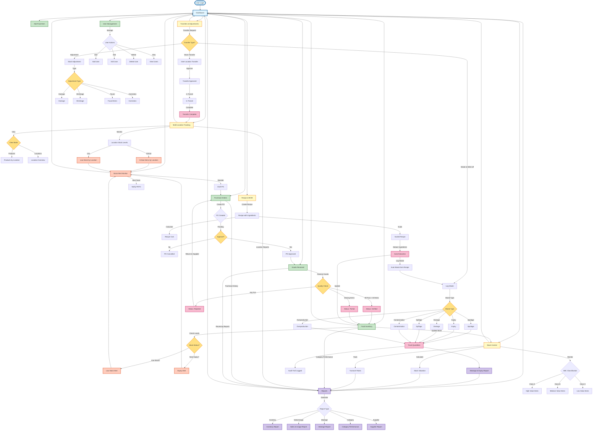

# CoCoders Food Inventory System - Data Flow Diagram

## System Overview

This diagram shows how data flows through the CoCoders Food Inventory Management System with all 12 modules.

---

## Complete Data Flow Diagram

````mermaid
graph TB
    %% Entry Point
    START([User Login]) --> DASHBOARD[Dashboard]

    %% Dashboard connects to all modules
    DASHBOARD --> STOCK_ALERT[Stock Alert Monitor]
    DASHBOARD --> INVENTORY[Food Inventory]
    DASHBOARD --> ADD_PRODUCT[Add Food Item]
    DASHBOARD --> PO[Purchase Orders]
    DASHBOARD --> GR[Goods Received]
    DASHBOARD --> SC[Stock Control]
    DASHBOARD --> RECI# CoCoders Food Inventory System - Data Flow Diagram

## System Overview
This diagram shows how data flows through the CoCoders Food Inventory Management System with all 12 modules.

---

## Complete Data Flow Diagram

```mermaid
graph TB
    %% Entry Point
    START([User Login]) --> DASHBOARD[Dashboard]

    %% Dashboard connects to all modules
    DASHBOARD --> STOCK_ALERT[Stock Alert Monitor]
    DASHBOARD --> INVENTORY[Food Inventory]
    DASHBOARD --> ADD_PRODUCT[Add Food Item]
    DASHBOARD --> PO[Purchase Orders]
    DASHBOARD --> GR[Goods Received]
    DASHBOARD --> SC[Stock Control]
    DASHBOARD --> RECIPE[Recipe & BOM]
    DASHBOARD --> TRANSFERS[Transfers & Adjustments]
    DASHBOARD --> MULTI_LOC[Multi-Location Tracking]
    DASHBOARD --> REPORTS[Reports]
    DASHBOARD --> USERS[User Management]

    %% Purchase Order Flow
    PO --> |Create PO| PO_CREATED{PO Created}
    PO_CREATED --> |Pending| PO_APPROVE{Approve?}
    PO_APPROVE --> |Yes| PO_APPROVED[PO Approved]
    PO_APPROVE --> |No| PO_CANCELLED[PO Cancelled]
    PO_APPROVED --> GR

    %% Goods Received Flow
    GR --> |Receive Goods| QUALITY_CHECK{Quality Check}
    QUALITY_CHECK --> |All Pass + All Items| GR_VERIFIED[Status: Verified]
    QUALITY_CHECK --> |Missing Items| GR_PARTIAL[Status: Partial]
    QUALITY_CHECK --> |Any Fail| GR_REJECTED[Status: Rejected]

    GR_VERIFIED --> INVENTORY
    GR_PARTIAL --> INVENTORY
    GR_REJECTED --> |Return to Supplier| PO

    %% Inventory Management
    INVENTORY --> |Update Stock| SC
    INVENTORY --> |Check Levels| STOCK_CHECK{Stock Status?}

    STOCK_CHECK --> |Low Stock?| LOW_STOCK[Low Stock Alert]
    STOCK_CHECK --> |Near Expiry?| EXPIRY_ALERT[Expiry Alert]

    LOW_STOCK --> STOCK_ALERT
    EXPIRY_ALERT --> STOCK_ALERT

    STOCK_ALERT --> |Reorder| PO_DRAFT[Draft PO]
    STOCK_ALERT --> |Alert Team| NOTIFY[Notify FEFO]
    PO_DRAFT --> PO

    %% Stock Control
    SC --> |Monitor| ABC_CLASS{ABC Classification}
    ABC_CLASS --> |Class A| HIGH_VALUE[High Value Items]
    ABC_CLASS --> |Class B| MED_VALUE[Medium Value Items]
    ABC_CLASS --> |Class C| LOW_VALUE[Low Value Items]

    SC --> |Track| TURNOVER[Turnover Rates]
    SC --> |Calculate| VALUATION[Stock Valuation]

    %% Recipe & BOM
    RECIPE --> |Create Recipe| RECIPE_CREATED[Recipe with Ingredients]
    RECIPE_CREATED --> |Calculate| RECIPE_COST[Recipe Cost]
    RECIPE_CREATED --> |Scale| RECIPE_SCALED[Scaled Recipe]
    RECIPE_SCALED --> |Deduct Ingredients| AUTO_DEDUCT[Auto Deduction]
    AUTO_DEDUCT --> |Update| INVENTORY
    AUTO_DEDUCT --> |Log Waste| WASTE_AUTO[Auto Waste from Recipe]

    %% Transfers & Adjustments
    TRANSFERS --> |Transfer Request| TRANSFER_REQ{Transfer Type?}
    TRANSFER_REQ --> |Stock Transfer| STOCK_TRANSFER[Inter-Location Transfer]
    TRANSFER_REQ --> |Adjustment| ADJUSTMENT[Stock Adjustment]
    TRANSFER_REQ --> |Waste & Write-off| WASTE_LOG[Log Waste]

    STOCK_TRANSFER --> |Approve| TRANSFER_APPROVED[Transfer Approved]
    TRANSFER_APPROVED --> |In Transit| TRANSFER_TRANSIT[In Transit]
    TRANSFER_TRANSIT --> |Complete| TRANSFER_COMPLETE[Transfer Complete]
    TRANSFER_COMPLETE --> MULTI_LOC

    ADJUSTMENT --> |Type| ADJ_TYPE{Adjustment Type}
    ADJ_TYPE --> |Damage| ADJ_DAMAGE[Damage]
    ADJ_TYPE --> |Shrinkage| ADJ_SHRINK[Shrinkage]
    ADJ_TYPE --> |Found| ADJ_FOUND[Found Items]
    ADJ_TYPE --> |Correction| ADJ_CORRECT[Correction]

    %% Waste & Write-offs
    WASTE_LOG --> |Waste Type| WASTE_TYPE{Waste Type}
    WASTE_TYPE --> |Spoilage| W_SPOIL[Spoilage]
    WASTE_TYPE --> |Expiry| W_EXPIRY[Expiry]
    WASTE_TYPE --> |Damage| W_DAMAGE[Damage]
    WASTE_TYPE --> |Spillage| W_SPILL[Spillage]
    WASTE_TYPE --> |Contamination| W_CONTAM[Contamination]
    WASTE_TYPE --> |Overproduction| W_OVERPROD[Overproduction]

    WASTE_AUTO --> WASTE_LOG
    W_SPOIL --> TRACK_QTY[Track Quantities]
    W_EXPIRY --> TRACK_QTY
    W_DAMAGE --> TRACK_QTY
    W_SPILL --> TRACK_QTY
    W_CONTAM --> TRACK_QTY
    W_OVERPROD --> TRACK_QTY

    TRACK_QTY --> WASTE_REPORT[Wastage & Expiry Report]
    TRACK_QTY --> AUDIT_TRAIL[Audit Trail Logged]

    %% Multi-Location Tracking
    MULTI_LOC --> |View| LOC_VIEW{View Mode}
    LOC_VIEW --> |Products| PROD_VIEW[Products by Location]
    LOC_VIEW --> |Locations| LOC_LIST[Location Overview]

    MULTI_LOC --> |Monitor| LOC_STOCK[Location Stock Levels]
    LOC_STOCK --> |Critical| LOC_CRITICAL[Critical Items by Location]
    LOC_STOCK --> |Low| LOC_LOW[Low Stock by Location]

    LOC_CRITICAL --> STOCK_ALERT
    LOC_LOW --> STOCK_ALERT

    %% Reporting
    WASTE_REPORT --> REPORTS
    VALUATION --> REPORTS
    TURNOVER --> REPORTS
    INVENTORY --> |Category Performance| REPORTS
    MULTI_LOC --> |Location Reports| REPORTS
    PO --> |Purchase History| REPORTS
    GR --> |Receiving Reports| REPORTS

    REPORTS --> |Generate| REPORT_TYPE{Report Type}
    REPORT_TYPE --> |Inventory| INV_REPORT[Inventory Report]
    REPORT_TYPE --> |Sales/Usage| SALES_REPORT[Sales & Usage Report]
    REPORT_TYPE --> |Wastage| WASTE_RPT[Wastage Report]
    REPORT_TYPE --> |Category| CAT_REPORT[Category Performance]
    REPORT_TYPE --> |Supplier| SUPP_REPORT[Supplier Report]

    %% User Management
    USERS --> |Manage| USER_CRUD{User Actions}
    USER_CRUD --> |Add| USER_ADD[Add User]
    USER_CRUD --> |Edit| USER_EDIT[Edit User]
    USER_CRUD --> |Delete| USER_DELETE[Delete User]
    USER_CRUD --> |View| USER_VIEW[View Users]

    %% All data feeds back to Dashboard
    INVENTORY --> DASHBOARD
    SC --> DASHBOARD
    STOCK_ALERT --> DASHBOARD
    REPORTS --> DASHBOARD
    MULTI_LOC --> DASHBOARD
    TRANSFERS --> DASHBOARD

    %% Styling
    classDef entryPoint fill:#e1f5ff,stroke:#01579b,stroke-width:3px
    classDef coreModule fill:#c8e6c9,stroke:#2e7d32,stroke-width:2px
    classDef modModule fill:#fff9c4,stroke:#f57f17,stroke-width:2px
    classDef process fill:#f8bbd0,stroke:#c2185b,stroke-width:2px
    classDef decision fill:#ffe082,stroke:#f57c00,stroke-width:2px
    classDef alert fill:#ffccbc,stroke:#d84315,stroke-width:2px
    classDef report fill:#d1c4e9,stroke:#5e35b1,stroke-width:2px

    class START,DASHBOARD entryPoint
    class INVENTORY,ADD_PRODUCT,PO,GR,USERS coreModule
    class SC,RECIPE,TRANSFERS,MULTI_LOC modModule
    class GR_VERIFIED,GR_PARTIAL,GR_REJECTED,AUTO_DEDUCT,TRANSFER_COMPLETE,TRACK_QTY process
    class QUALITY_CHECK,STOCK_CHECK,PO_APPROVE,TRANSFER_REQ,ADJ_TYPE,WASTE_TYPE,LOC_VIEW decision
    class STOCK_ALERT,LOW_STOCK,EXPIRY_ALERT,LOC_CRITICAL,LOC_LOW alert
    class REPORTS,WASTE_REPORT,INV_REPORT,SALES_REPORT,WASTE_RPT,CAT_REPORT,SUPP_REPORT report
````

---

## Key Data Flows

### 1. **Purchase to Inventory Flow**

```
Purchase Orders → Goods Received → Quality Check → Inventory → Stock Control
```

### 2. **Stock Alert Flow**

```
Stock Control → Low Stock/Near Expiry Detection → Stock Alert Monitor → Draft Purchase Order
```

### 3. **Recipe Production Flow**

```
Recipe & BOM → Auto Deduction → Update Inventory → Log Waste (if applicable)
```

### 4. **Waste Tracking Flow**

```
Waste Log → Track Quantities → Wastage & Expiry Report → Audit Trail
```

### 5. **Multi-Location Flow**

```
Transfers & Adjustments → Transfer Approval → In Transit → Complete → Multi-Location Update
```

### 6. **Reporting Flow**

```
All Modules → Aggregate Data → Reports → Dashboard
```

---

## Module Descriptions

### **Entry & Dashboard**

- **Login**: User authentication gateway
- **Dashboard**: Central hub connecting all modules with key metrics

### **Core Operations Modules**

- **Food Inventory**: Master inventory database
- **Add Food Item**: Product and category management
- **Purchase Orders**: Supplier ordering with flexible pricing
- **Goods Received**: Quality inspection and receiving
- **Stock Alert Monitor**: Low stock and expiry monitoring

### **MOD: Advanced Modules** (From Diagram)

- **Stock Control**: ABC classification, turnover rates, valuation
- **Recipe & BOM**: Recipe management, cost calculation, ingredient tracking
- **Transfers & Adjustments**: Stock transfers, adjustments, waste logging
- **Multi-Location Tracking**: Cross-location inventory visibility

### **Management & Reporting**

- **Reports**: Comprehensive reporting across all modules
- **User Management**: User access and role management

---

## Critical Decision Points

1. **Quality Check** (Goods Received)
   - All Pass + All Items → Verified
   - Missing Items → Partial
   - Any Fail → Rejected

2. **Stock Status** (Inventory)
   - Low Stock → Alert + Reorder
   - Near Expiry → Alert + FEFO Priority

3. **ABC Classification** (Stock Control)
   - Class A: High value items
   - Class B: Medium value items
   - Class C: Low value items

4. **Waste Type** (Transfers & Adjustments)
   - Spoilage, Expiry, Damage, Spillage, Contamination, Overproduction

---

## Data Integration Points

### **Inputs**

- Supplier data (Purchase Orders)
- Quality inspection results (Goods Received)
- Recipe ingredients (Recipe & BOM)
- Waste events (Transfers & Adjustments)
- Location transfers (Multi-Location)

### **Outputs**

- Stock alerts (Stock Alert Monitor)
- Wastage reports (Wastage & Expiry Report)
- Audit trails (All transactions)
- Performance reports (Reports module)
- Dashboard metrics (Real-time KPIs)

---

## System Generated: May 27, 2026

# CoCoders Food Inventory System - Data Flow Diagram

## System Overview

This diagram shows how data flows through the CoCoders Food Inventory Management System with all 12 modules.

---

## Complete Data Flow Diagram


---

## Key Data Flows

### 1. **Purchase to Inventory Flow**

```
Purchase Orders → Goods Received → Quality Check → Inventory → Stock Control
```

### 2. **Stock Alert Flow**

```
Stock Control → Low Stock/Near Expiry Detection → Stock Alert Monitor → Draft Purchase Order
```

### 3. **Recipe Production Flow**

```
Recipe & BOM → Auto Deduction → Update Inventory → Log Waste (if applicable)
```

### 4. **Waste Tracking Flow**

```
Waste Log → Track Quantities → Wastage & Expiry Report → Audit Trail
```

### 5. **Multi-Location Flow**

```
Transfers & Adjustments → Transfer Approval → In Transit → Complete → Multi-Location Update
```

### 6. **Reporting Flow**

```
All Modules → Aggregate Data → Reports → Dashboard
```

---

## Module Descriptions

### **Entry & Dashboard**

- **Login**: User authentication gateway
- **Dashboard**: Central hub connecting all modules with key metrics

### **Core Operations Modules**

- **Food Inventory**: Master inventory database
- **Add Food Item**: Product and category management
- **Purchase Orders**: Supplier ordering with flexible pricing
- **Goods Received**: Quality inspection and receiving
- **Stock Alert Monitor**: Low stock and expiry monitoring

### **MOD: Advanced Modules** (From Diagram)

- **Stock Control**: ABC classification, turnover rates, valuation
- **Recipe & BOM**: Recipe management, cost calculation, ingredient tracking
- **Transfers & Adjustments**: Stock transfers, adjustments, waste logging
- **Multi-Location Tracking**: Cross-location inventory visibility

### **Management & Reporting**

- **Reports**: Comprehensive reporting across all modules
- **User Management**: User access and role management

---

## Critical Decision Points

1. **Quality Check** (Goods Received)
   - All Pass + All Items → Verified
   - Missing Items → Partial
   - Any Fail → Rejected

2. **Stock Status** (Inventory)
   - Low Stock → Alert + Reorder
   - Near Expiry → Alert + FEFO Priority

3. **ABC Classification** (Stock Control)
   - Class A: High value items
   - Class B: Medium value items
   - Class C: Low value items

4. **Waste Type** (Transfers & Adjustments)
   - Spoilage, Expiry, Damage, Spillage, Contamination, Overproduction

---

## Data Integration Points

### **Inputs**

- Supplier data (Purchase Orders)
- Quality inspection results (Goods Received)
- Recipe ingredients (Recipe & BOM)
- Waste events (Transfers & Adjustments)
- Location transfers (Multi-Location)

### **Outputs**

- Stock alerts (Stock Alert Monitor)
- Wastage reports (Wastage & Expiry Report)
- Audit trails (All transactions)
- Performance reports (Reports module)
- Dashboard metrics (Real-time KPIs)

---

## System Generated: May 27, 2026

# CoCoders Food Inventory System - Data Flow Diagram

## System Overview

This diagram shows how data flows through the CoCoders Food Inventory Management System with all 12 modules.

---

## Complete Data Flow Diagram



---

## Key Data Flows

### 1. **Purchase to Inventory Flow**

```
Purchase Orders → Goods Received → Quality Check → Inventory → Stock Control
```

### 2. **Stock Alert Flow**

```
Stock Control → Low Stock/Near Expiry Detection → Stock Alert Monitor → Draft Purchase Order
```

### 3. **Recipe Production Flow**

```
Recipe & BOM → Auto Deduction → Update Inventory → Log Waste (if applicable)
```

### 4. **Waste Tracking Flow**

```
Waste Log → Track Quantities → Wastage & Expiry Report → Audit Trail
```

### 5. **Multi-Location Flow**

```
Transfers & Adjustments → Transfer Approval → In Transit → Complete → Multi-Location Update
```

### 6. **Reporting Flow**

```
All Modules → Aggregate Data → Reports → Dashboard
```

---

## Module Descriptions

### **Entry & Dashboard**

- **Login**: User authentication gateway
- **Dashboard**: Central hub connecting all modules with key metrics

### **Core Operations Modules**

- **Food Inventory**: Master inventory database
- **Add Food Item**: Product and category management
- **Purchase Orders**: Supplier ordering with flexible pricing
- **Goods Received**: Quality inspection and receiving
- **Stock Alert Monitor**: Low stock and expiry monitoring

### **MOD: Advanced Modules** (From Diagram)

- **Stock Control**: ABC classification, turnover rates, valuation
- **Recipe & BOM**: Recipe management, cost calculation, ingredient tracking
- **Transfers & Adjustments**: Stock transfers, adjustments, waste logging
- **Multi-Location Tracking**: Cross-location inventory visibility

### **Management & Reporting**

- **Reports**: Comprehensive reporting across all modules
- **User Management**: User access and role management

---

## Critical Decision Points

1. **Quality Check** (Goods Received)
   - All Pass + All Items → Verified
   - Missing Items → Partial
   - Any Fail → Rejected

2. **Stock Status** (Inventory)
   - Low Stock → Alert + Reorder
   - Near Expiry → Alert + FEFO Priority

3. **ABC Classification** (Stock Control)
   - Class A: High value items
   - Class B: Medium value items
   - Class C: Low value items

4. **Waste Type** (Transfers & Adjustments)
   - Spoilage, Expiry, Damage, Spillage, Contamination, Overproduction

---

## Data Integration Points

### **Inputs**

- Supplier data (Purchase Orders)
- Quality inspection results (Goods Received)
- Recipe ingredients (Recipe & BOM)
- Waste events (Transfers & Adjustments)
- Location transfers (Multi-Location)

### **Outputs**

- Stock alerts (Stock Alert Monitor)
- Wastage reports (Wastage & Expiry Report)
- Audit trails (All transactions)
- Performance reports (Reports module)
- Dashboard metrics (Real-time KPIs)

---

## System Generated: May 27, 2026

PE[Recipe & BOM]
DASHBOARD --> TRANSFERS[Transfers & Adjustments]
DASHBOARD --> MULTI_LOC[Multi-Location Tracking]
DASHBOARD --> REPORTS[Reports]
DASHBOARD --> USERS[User Management]

    %% Purchase Order Flow
    PO --> |Create PO| PO_CREATED{PO Created}
    PO_CREATED --> |Pending| PO_APPROVE{Approve?}
    PO_APPROVE --> |Yes| PO_APPROVED[PO Approved]
    PO_APPROVE --> |No| PO_CANCELLED[PO Cancelled]
    PO_APPROVED --> GR

    %% Goods Received Flow
    GR --> |Receive Goods| QUALITY_CHECK{Quality Check}
    QUALITY_CHECK --> |All Pass + All Items| GR_VERIFIED[Status: Verified]
    QUALITY_CHECK --> |Missing Items| GR_PARTIAL[Status: Partial]
    QUALITY_CHECK --> |Any Fail| GR_REJECTED[Status: Rejected]

    GR_VERIFIED --> INVENTORY
    GR_PARTIAL --> INVENTORY
    GR_REJECTED --> |Return to Supplier| PO

    %% Inventory Management
    INVENTORY --> |Update Stock| SC
    INVENTORY --> |Check Levels| STOCK_CHECK{Stock Status?}

    STOCK_CHECK --> |Low Stock?| LOW_STOCK[Low Stock Alert]
    STOCK_CHECK --> |Near Expiry?| EXPIRY_ALERT[Expiry Alert]

    LOW_STOCK --> STOCK_ALERT
    EXPIRY_ALERT --> STOCK_ALERT

    STOCK_ALERT --> |Reorder| PO_DRAFT[Draft PO]
    STOCK_ALERT --> |Alert Team| NOTIFY[Notify FEFO]
    PO_DRAFT --> PO

    %% Stock Control
    SC --> |Monitor| ABC_CLASS{ABC Classification}
    ABC_CLASS --> |Class A| HIGH_VALUE[High Value Items]
    ABC_CLASS --> |Class B| MED_VALUE[Medium Value Items]
    ABC_CLASS --> |Class C| LOW_VALUE[Low Value Items]

    SC --> |Track| TURNOVER[Turnover Rates]
    SC --> |Calculate| VALUATION[Stock Valuation]

    %% Recipe & BOM
    RECIPE --> |Create Recipe| RECIPE_CREATED[Recipe with Ingredients]
    RECIPE_CREATED --> |Calculate| RECIPE_COST[Recipe Cost]
    RECIPE_CREATED --> |Scale| RECIPE_SCALED[Scaled Recipe]
    RECIPE_SCALED --> |Deduct Ingredients| AUTO_DEDUCT[Auto Deduction]
    AUTO_DEDUCT --> |Update| INVENTORY
    AUTO_DEDUCT --> |Log Waste| WASTE_AUTO[Auto Waste from Recipe]

    %% Transfers & Adjustments
    TRANSFERS --> |Transfer Request| TRANSFER_REQ{Transfer Type?}
    TRANSFER_REQ --> |Stock Transfer| STOCK_TRANSFER[Inter-Location Transfer]
    TRANSFER_REQ --> |Adjustment| ADJUSTMENT[Stock Adjustment]
    TRANSFER_REQ --> |Waste & Write-off| WASTE_LOG[Log Waste]

    STOCK_TRANSFER --> |Approve| TRANSFER_APPROVED[Transfer Approved]
    TRANSFER_APPROVED --> |In Transit| TRANSFER_TRANSIT[In Transit]
    TRANSFER_TRANSIT --> |Complete| TRANSFER_COMPLETE[Transfer Complete]
    TRANSFER_COMPLETE --> MULTI_LOC

    ADJUSTMENT --> |Type| ADJ_TYPE{Adjustment Type}
    ADJ_TYPE --> |Damage| ADJ_DAMAGE[Damage]
    ADJ_TYPE --> |Shrinkage| ADJ_SHRINK[Shrinkage]
    ADJ_TYPE --> |Found| ADJ_FOUND[Found Items]
    ADJ_TYPE --> |Correction| ADJ_CORRECT[Correction]

    %% Waste & Write-offs
    WASTE_LOG --> |Waste Type| WASTE_TYPE{Waste Type}
    WASTE_TYPE --> |Spoilage| W_SPOIL[Spoilage]
    WASTE_TYPE --> |Expiry| W_EXPIRY[Expiry]
    WASTE_TYPE --> |Damage| W_DAMAGE[Damage]
    WASTE_TYPE --> |Spillage| W_SPILL[Spillage]
    WASTE_TYPE --> |Contamination| W_CONTAM[Contamination]
    WASTE_TYPE --> |Overproduction| W_OVERPROD[Overproduction]

    WASTE_AUTO --> WASTE_LOG
    W_SPOIL --> TRACK_QTY[Track Quantities]
    W_EXPIRY --> TRACK_QTY
    W_DAMAGE --> TRACK_QTY
    W_SPILL --> TRACK_QTY
    W_CONTAM --> TRACK_QTY
    W_OVERPROD --> TRACK_QTY

    TRACK_QTY --> WASTE_REPORT[Wastage & Expiry Report]
    TRACK_QTY --> AUDIT_TRAIL[Audit Trail Logged]

    %% Multi-Location Tracking
    MULTI_LOC --> |View| LOC_VIEW{View Mode}
    LOC_VIEW --> |Products| PROD_VIEW[Products by Location]
    LOC_VIEW --> |Locations| LOC_LIST[Location Overview]

    MULTI_LOC --> |Monitor| LOC_STOCK[Location Stock Levels]
    LOC_STOCK --> |Critical| LOC_CRITICAL[Critical Items by Location]
    LOC_STOCK --> |Low| LOC_LOW[Low Stock by Location]

    LOC_CRITICAL --> STOCK_ALERT
    LOC_LOW --> STOCK_ALERT

    %% Reporting
    WASTE_REPORT --> REPORTS
    VALUATION --> REPORTS
    TURNOVER --> REPORTS
    INVENTORY --> |Category Performance| REPORTS
    MULTI_LOC --> |Location Reports| REPORTS
    PO --> |Purchase History| REPORTS
    GR --> |Receiving Reports| REPORTS

    REPORTS --> |Generate| REPORT_TYPE{Report Type}
    REPORT_TYPE --> |Inventory| INV_REPORT[Inventory Report]
    REPORT_TYPE --> |Sales/Usage| SALES_REPORT[Sales & Usage Report]
    REPORT_TYPE --> |Wastage| WASTE_RPT[Wastage Report]
    REPORT_TYPE --> |Category| CAT_REPORT[Category Performance]
    REPORT_TYPE --> |Supplier| SUPP_REPORT[Supplier Report]

    %% User Management
    USERS --> |Manage| USER_CRUD{User Actions}
    USER_CRUD --> |Add| USER_ADD[Add User]
    USER_CRUD --> |Edit| USER_EDIT[Edit User]
    USER_CRUD --> |Delete| USER_DELETE[Delete User]
    USER_CRUD --> |View| USER_VIEW[View Users]

    %% All data feeds back to Dashboard
    INVENTORY --> DASHBOARD
    SC --> DASHBOARD
    STOCK_ALERT --> DASHBOARD
    REPORTS --> DASHBOARD
    MULTI_LOC --> DASHBOARD
    TRANSFERS --> DASHBOARD

    %% Styling
    classDef entryPoint fill:#e1f5ff,stroke:#01579b,stroke-width:3px
    classDef coreModule fill:#c8e6c9,stroke:#2e7d32,stroke-width:2px
    classDef modModule fill:#fff9c4,stroke:#f57f17,stroke-width:2px
    classDef process fill:#f8bbd0,stroke:#c2185b,stroke-width:2px
    classDef decision fill:#ffe082,stroke:#f57c00,stroke-width:2px
    classDef alert fill:#ffccbc,stroke:#d84315,stroke-width:2px
    classDef report fill:#d1c4e9,stroke:#5e35b1,stroke-width:2px

    class START,DASHBOARD entryPoint
    class INVENTORY,ADD_PRODUCT,PO,GR,USERS coreModule
    class SC,RECIPE,TRANSFERS,MULTI_LOC modModule
    class GR_VERIFIED,GR_PARTIAL,GR_REJECTED,AUTO_DEDUCT,TRANSFER_COMPLETE,TRACK_QTY process
    class QUALITY_CHECK,STOCK_CHECK,PO_APPROVE,TRANSFER_REQ,ADJ_TYPE,WASTE_TYPE,LOC_VIEW decision
    class STOCK_ALERT,LOW_STOCK,EXPIRY_ALERT,LOC_CRITICAL,LOC_LOW alert
    class REPORTS,WASTE_REPORT,INV_REPORT,SALES_REPORT,WASTE_RPT,CAT_REPORT,SUPP_REPORT report

```

---

## Key Data Flows

### 1. **Purchase to Inventory Flow**
```

Purchase Orders → Goods Received → Quality Check → Inventory → Stock Control

```

### 2. **Stock Alert Flow**
```

Stock Control → Low Stock/Near Expiry Detection → Stock Alert Monitor → Draft Purchase Order

```

### 3. **Recipe Production Flow**
```

Recipe & BOM → Auto Deduction → Update Inventory → Log Waste (if applicable)

```

### 4. **Waste Tracking Flow**
```

Waste Log → Track Quantities → Wastage & Expiry Report → Audit Trail

```

### 5. **Multi-Location Flow**
```

Transfers & Adjustments → Transfer Approval → In Transit → Complete → Multi-Location Update

```

### 6. **Reporting Flow**
```

All Modules → Aggregate Data → Reports → Dashboard

```

---

## Module Descriptions

### **Entry & Dashboard**
- **Login**: User authentication gateway
- **Dashboard**: Central hub connecting all modules with key metrics

### **Core Operations Modules**
- **Food Inventory**: Master inventory database
- **Add Food Item**: Product and category management
- **Purchase Orders**: Supplier ordering with flexible pricing
- **Goods Received**: Quality inspection and receiving
- **Stock Alert Monitor**: Low stock and expiry monitoring

### **MOD: Advanced Modules** (From Diagram)
- **Stock Control**: ABC classification, turnover rates, valuation
- **Recipe & BOM**: Recipe management, cost calculation, ingredient tracking
- **Transfers & Adjustments**: Stock transfers, adjustments, waste logging
- **Multi-Location Tracking**: Cross-location inventory visibility

### **Management & Reporting**
- **Reports**: Comprehensive reporting across all modules
- **User Management**: User access and role management

---

## Critical Decision Points

1. **Quality Check** (Goods Received)
   - All Pass + All Items → Verified
   - Missing Items → Partial
   - Any Fail → Rejected

2. **Stock Status** (Inventory)
   - Low Stock → Alert + Reorder
   - Near Expiry → Alert + FEFO Priority

3. **ABC Classification** (Stock Control)
   - Class A: High value items
   - Class B: Medium value items
   - Class C: Low value items

4. **Waste Type** (Transfers & Adjustments)
   - Spoilage, Expiry, Damage, Spillage, Contamination, Overproduction

---

## Data Integration Points

### **Inputs**
- Supplier data (Purchase Orders)
- Quality inspection results (Goods Received)
- Recipe ingredients (Recipe & BOM)
- Waste events (Transfers & Adjustments)
- Location transfers (Multi-Location)

### **Outputs**
- Stock alerts (Stock Alert Monitor)
- Wastage reports (Wastage & Expiry Report)
- Audit trails (All transactions)
- Performance reports (Reports module)
- Dashboard metrics (Real-time KPIs)

---

## System Generated: May 27, 2026
```
